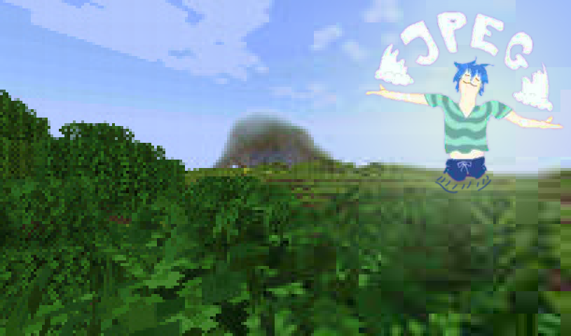

# JPEG Shaders for Minecraft

## table of content
|No.|Topic|Go there|
|---|---|---|
|1.|Disclaimers...|[Jump](#1-language-disclaimer-lel)|
|2.|What is this?, exactly?|[Jump](#2-what-is-this-exactly)|
|3.|What is it capable of?, currently?|[Jump](#3-what-is-it-capable-of-currently)|
|4.|Any risks with this product?|[Jump](#4-any-risks-with-this-product)|
|5.|How to use it?|[Jump](#5-how-to-use-it)|
|6.|What is the future of this project?|[Jump](#6-what-is-the-future-of-this-project)|
|7.|Why it exists?|[Jump](#7-why-it-exists)|
|8.|What is the licence?|[Link](/licence)|
|9.|Show Me tha screenshotz!|[Jump](#9-show-me-tha-screenshotz)|
## 1. Disclaimers...
1. I'm sorry for any ***inconvenience*** and eyesore due to my spelling, as i'm not a native english speaker, but a polish person who grew up with english. I'm kinda ***surprised***, that i remember the spellings of ***these*** ***difficult*** words. It's ***naturally*** hard. - Well, if You Guyz find any mistakes, let me know or Let's fix them.
2. Sorry for any overlooks.
[Take me up!](#table-of-content)

## 2. What is this?, exactly?
This is a shaderpack compatibile with _The Opti*ine Mod_. It aims to recreate the iconic JPEG artifacts and feel of a very lossy JPEG compressed image - in real-time.

 Like basicly every frame could be a separate compressed image - not to confuse with MPEG what is like JPEG but for continuous video.

[Take me up!](#table-of-content)

## 3. What is it capable of?, currently?
1. You can perform the JPEG compression in three different colorspaces.
2. Round colors (quantize) before and after the JPEG stuff, in the selected colorspace.
3. Decrease resolution (downsampling) of the image to see the effect better, and smooth out the super-pixel by averaging color of some samples (supersampling).
4. Degrade the image, by using one of three methods, including OG Quality Factor!

[Take me up!](#table-of-content)

## 4. Any risks with this product?
1. I am aware out of experience and testing, that this shaderpack makes moving camera, at lower qualities, kinda flashy, so beware of eye fatigue and epilepsy. - Being MPEG would help (different algorithm for handling from-frame-to-frame transitions bla bla bla), but i don't know at this point if it'd be possible to make MPEG shaders.
2. I'm not sure of the

[Take me up!](#table-of-content)

## 5. How to use it?
|No.|Topic|Go there|
|---|---|---|
|1.|Main TOC|[Jump](#table-of-content)|
|5.1.|Installation|[Jump](#51-installation)|
|5.2.|Enabling|[Jump](#52-enabling)|
|5.3.|Accessing settings|[Jump](#53-accessing-settings)|
|5.4.|Shader Editing|[Jump](#54-shader-editing)|
### 5.1. Installation
There probably are multiple methods to obtain the shaders now.

For example, You can click the "Code" button on the Github page and click "Download ZIP".

Then place the Zip in the `shaderpacks` minecraft folder - explicitly: go to the folder with Your worlds, go up one folder, and there will be a folder named "shaderpacks" (or make one).

[Take me up!](#5-how-to-use-it)

### 5.2. Enabling
Enable the pack by going to the in-game settings, Video Settings, Shaders, and select the JPEG Shaders.

[Take me up!](#5-how-to-use-it)

### 5.3. Accessing Settings
Going to the in-game settings, Video Settings, Shaders, click the "Shader options" button, which leads to the config menu - have fun!

[Take me up!](#5-how-to-use-it)

### 5.4. Shader Editing
> advanced Users only!

> programming stuff!

To edit the shaders, You don't need enything special: just edit programs directly (the `.fsh` files - fragment shaders, or pixel shaders (the `.vsh` are geometry stuff and are just boilerplate))

The `.vsh` are copy+pasted with just a poilerplate code to make them just work. - However the only thing they do, that is important for me, is that here i get the `_xy` variable filled with pixel coordinates for `.fsh`.

In the `private` folder i did include the code to generate textures for shaders. - Even though this folder's content isn't supposed to be included. Creating pulls or other stuff, You can also add here stuff that is very important, but i think i'll make a separate folder for meta stuff of this pack.

[Take me up!](#5-how-to-use-it)

## 6. What is the future of this project?
I don't have eny more good ideas, but if You have eny of optimization or feature, then Let's do them someday.

[Take me up!](#table-of-content)

## 7. Why it exists?
Mostly coz:
1. it's interesting to me: how those patterns look, how they change, and it's all real-time no latency!
2. it was interesting to try to implement!: "How can i go about doing this, hmmmm..."
3. it was fun to think of ways to optimize it.: "It's laggy, but works! How to speed this up, hmmmm..."
4. isn't it a bit sensational, if it'd exist?

If i see a way, and that it has potential, i do it. - reasonably of course. But Let's have fun.
## 8. What is the licence?
I succ at licencing, so it's "open source" i guess...

Read it here: [Link](/licence)

[Take me up!](#table-of-content)

# 9. Show Me tha screenshotz!
### 9.1. Subtile Effect
|||
|---|---|
|Quality|92%|

### 9.2. Effect Visible
|||
|---|---|
|Quality|78%|

### 9.3. Strong Effect
|||
|---|---|
|Quality|42%|

### 9.4. Now We use CMYK like on the Printer
|||
|---|---|
|Color Space|CMYK|
|Quality|34%|

### 9.5. Now using very rounded RGB colors, We used Very Strong Effect
|||
|---|---|
|Color Space|RGB|
|Quality|21%|
|Colors per Channel|24x16x16xOG|

[Take me up!](#table-of-content)

--------------------------------

Thank You for Your attention, have fun!